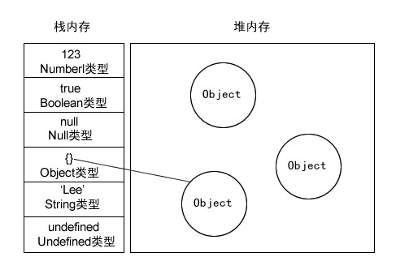
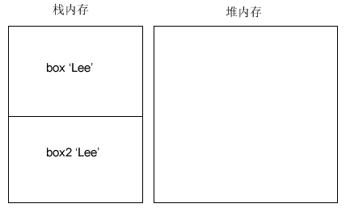
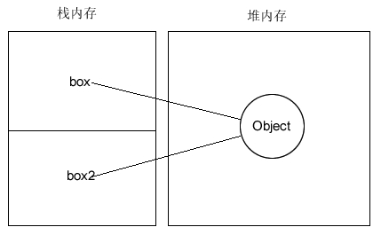
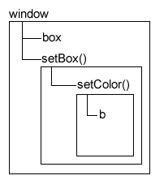
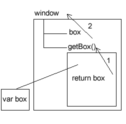

## 变量及作用域

+ 基本类型和引用类型的值：基本类型值指的是那些保存在栈内存中的简单数据段，即这种值完全保存在内存中的一个位置。而引用类型值则是指那些保存在堆内存中的对象，意思是变量中保存的实际上只是一个指针，这个指针指向内存中的另一个位置，该位置保存对象
+ 按引用访问：如果赋值的是引用类型的值，则必须在堆内存中为这个值分配空间。由于这种值的大小不固定，因此不能把它们保存到栈内存中。但内存地址大小的固定的，因此可以将内存地址保存在栈内存中。这样，当查询引用类型的变量时，先从栈中读取内存地址，然后再通过地址找到堆中的值。对于这种，我们把它叫做按引用访问。



+ 动态属性
    
  定义基本类型值和引用类型值的方式是相似的：创建一个变量并为该变量赋值。但是，当这个值保存到变量中以后，对不同类型值可以执行的操作则大相径庭。
```javascript:;
    var box = new Object();   //创建引用类型
    box.name = 'Lee';         //新增一个属性
    alert(box.name);          //输出
```
  
  如果是基本类型的值添加属性的话，就会出现问题了
```javascript:;
    var box = 'Lee';      //创建一个基本类型
    box.age = 27;         //给基本类型添加属性
    alert(box.age);       //undefined
```
  
+ 复制变量值
    
  在变量复制方面，基本类型和引用类型也有所不同。基本类型复制的是值本身，而引用类型复制的是地址。
```javascript:;

    var box = 'Lee';    //在栈内存生成一个 box 'Lee'
    var box2 = box; //在栈内存再生成一个 box2 'Lee'

```

        
box2 虽然是 box1的一个副本，但从图示可以看出，它是完全独立的。也就是说，两个变量分别操作时互不影响。

```javascript:;
  var box = new Object();    //创建一个引用类型
  box.name = 'Lee';      //新增一个属性
  var box2 = box;       //把引用地址赋值给 box2

```
        


在引用类型中，box2其实就是box，因为他们指向的是同一个对象。如果这个对象中的name属性被修改了，box2.name和box.name 输出的值都会被相应修改掉了。 
    
传递参数参数不会按引用传递，所有函数的参数都是按值传递
    
        按值传递
```javascript:;
  function box(num) {     //按值传递，传递的参数是基本类型
      var num += 10;         //这里的 num 是局部变量，全局无效
      return num;
  }
  var num = 50;
  var result = box(num);
  alert(result);        //60
  alert(num);     //50

```
        
        下面给出一个参数作为引用类型的例子。
```javascript:;

    function box(obj) { //按值传递，传递的参数是引用类型
        obj.name = 'Lee';
    }
    var p = new Object();
    box(p);
    alert(p.name);     //Lee
```

如果存在按引用传递的话，那么函数里的那个变量将会是全局变量，在外部也可以访问。
所以按引用传递和传递引用类型是两个不同的概念

```javascript:;
    我们再看一下这个例子
    function box(obj) {
        obj.name = 'Lee';
        obj = new Object(); //函数内部又创建了一个对象
        obj.name = 'Mr.';   //并没有替换掉原来的 obj
    }
    var p = new Object();
    box(p);
    alert(p.name);         //Lee

```
最后得出结论，ECMAScript函数的参数都将是局部变量，也就是说，没有按引用传递。
    

检测类型要检测一个变量的类型，我们可以通过 typeof 运算符来判别.虽然 typeof 运算符在检查基本数据类型的时候非常好用，但检测引用类型的时候，它就不是那么好用了。通常，我们并不想知道它是不是对象，而是想知道它到底是什么类型的对象。因为数组也是 object，null 也是 Object 等等。这时我们应该采用 instanceof 运算符来查看
```javascript:;

    var box = [1,2,3];  
    alert(box instanceof Array);        //是否是数组
    var box2 = {};
    alert(box2 instanceof Object);      //是否是对象
    var box3 = /g/;
    alert(box3 instanceof RegExp);      //是否是正则表达式
    var box4 = new String('Lee');
    alert(box4 instanceof String);      //是否是字符串对象
    //  当使用 instanceof 检查基本类型的值时，它会返回 false
```

执行环境及作用域执行环境是 JavaScript 中最为重要的一个概念。执行环境定义了变量或函数有权访问的其他数据，决定了它们各自的行为。<br/>执行环境是 JavaScript 中最为重要的一个概念。执行环境定义了变量或函数有权访问的其他数据，决定了它们各自的行为。
```javascript:;
  
    var box = 'blue';   //声明一个全局变量
    function setBox() {
        alert(box); //全局变量可以在函数里访问
    }
    setBox();   //执行函数


    // 全局的变量和函数，都是 window 对象的属性和方法。
    var box = 'blue';
    function setBox() {
        alert(window.box);  //全局变量即 window 的属性
    }
    window.setBox();    //全局函数即 window 的方法
    // 当执行环境中的所有代码执行完毕后，该环境被销毁，保存在其中的所有变量和函数定义也随之销毁。如果是全局环境下，需要程序执行完毕，或者网页被关闭才会销毁。
    // 每个执行环境都有一个与之关联的变量对象，就好比全局的 window 可以调用变量和属性一样。局部的环境也有一个类似 window 的变量对象，环境中定义的所有变量和函数都保存在这个对象中。(我们无法访问这个变量对象，但解析器会处理数据时后台使用它)
    

    var box = 'blue';
    function setBox(box) {      //通过传参，替换了全局变量
        alert(box);
    }
    setBox('red');
    alert(box);
    // 通过传参，可以替换函数体内的局部变量，但作用域仅限在函数体内这个局部环境。
      

    var box = 'blue';
    function setBox() {
        function setColor() {
            var b = 'orange';
            alert(box);
            alert(b);
        }
        setColor();           //setColor()的执行环境在 setBox()内
    }
    setBox();
    // => 输出blue  orange
    // 函数体内还包含着函数，只有这个函数才可以访问内一层的函数。

每个函数被调用时都会创建自己的执行环境。当执行到这个函数时，函数的环境就会被推到环境栈中去执行，而执行后又在环境栈中弹出(退出)，把控制权交给上一级的执行环境。<br/>当代码在一个环境中执行时，就会形成一种叫做作用域链的东西。行环境中它的用途是保证对执有访问权限的变量和函数进行有序访问。作用域链的前端，就是执行环境的变量对象。
```



没有块级作用域:块级作用域表示诸如if语句等有花括号封闭的代码块，所以，支持条件判断来定义变量。
    if语句、for语句代码块都没有局部作用域
```javascript:;
    一般确定变量都是通过搜索来确定该标识符实际代表什么。
    var box = 'blue';
    function getBox() {
        return box;             //代表全局 box
    }                           //如果加上函数体内加上 var box = 'red'
    alert(getBox());            //那么最后返回值就是 red

```



变量查询中，访问局部变量要比全局变量更快，因为不需要向上搜索作用域链。

内存问题
一般来说，确保占用最少的内存可以让页面获得更好的性能。那么优化内存的最佳方案，就是一旦数据不再有用，那么将其设置为 null来释放引用，这个做法叫做解除引用。这一做法适用于大多数全局变量和全局对象。
```javascript:;
  
    var o = {
        name : 'Lee'
    };
    o = null;   //解除对象引用，等待垃圾收集器回收
```